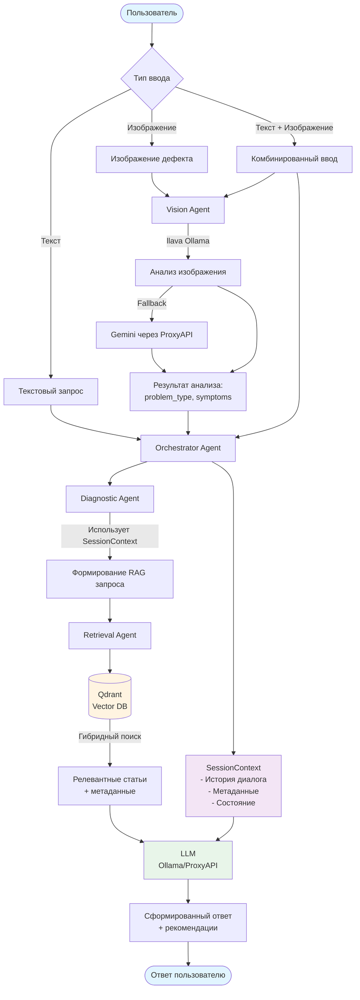
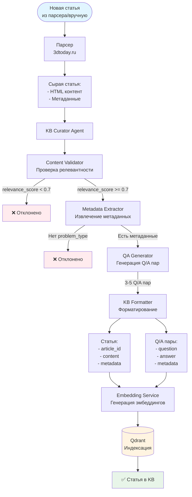
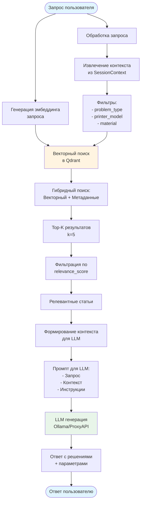
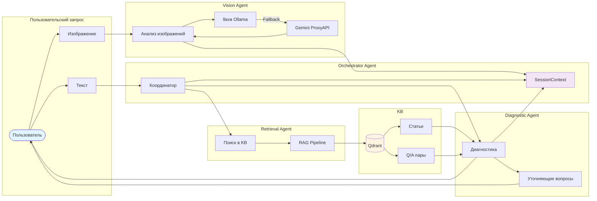
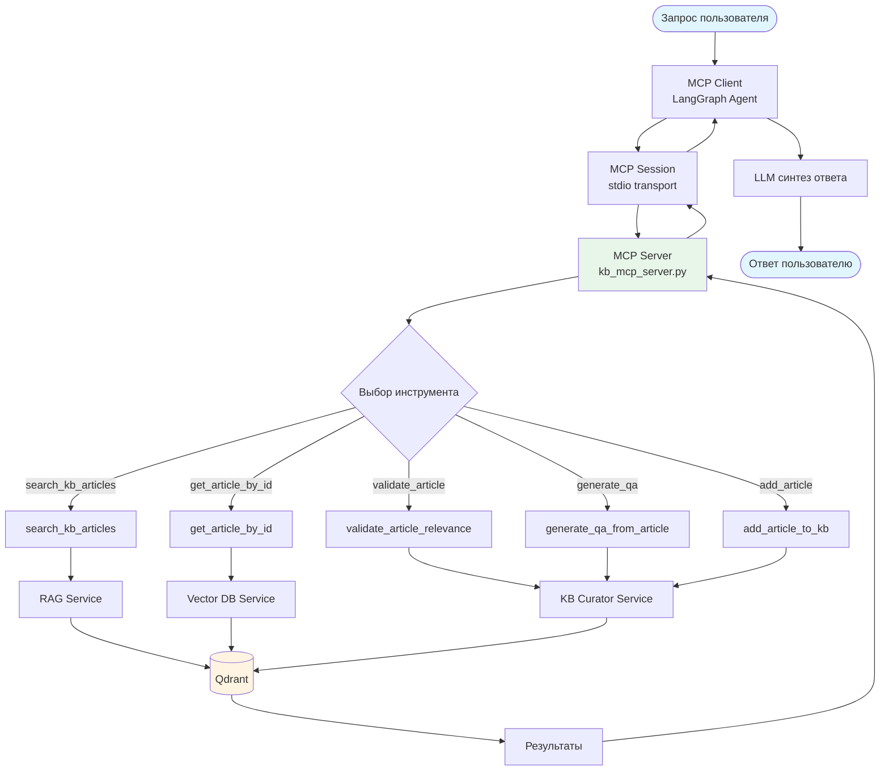
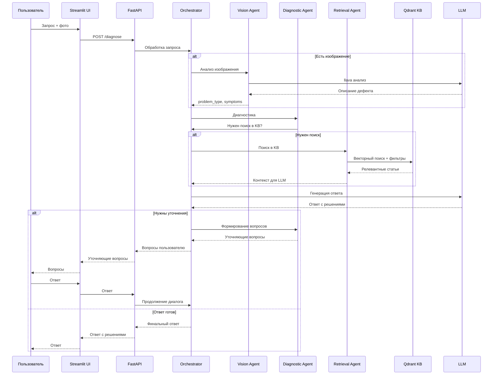
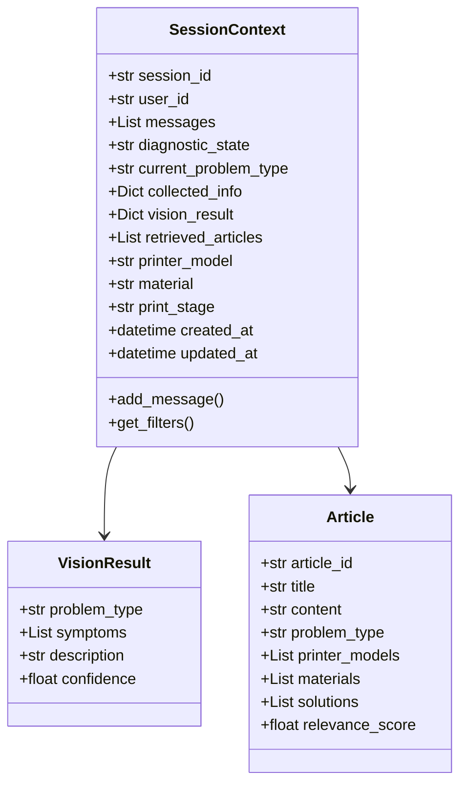

# Блок-схема датафлоу проекта 3dtoday

## 📊 Основной поток данных (диагностика)

## 🔄 Поток данных для добавления статей в KB

## 🔍 Поток данных RAG поиска

## 🤖 Архитектура агентов и их взаимодействие

## 📥 Поток данных MCP Agent (через MCP протокол)

## 🔄 Полный цикл: от запроса до ответа

## 📊 Структура данных в SessionContext

## 🎯 Ключевые точки данных

### Входные данные:
1. **Текстовый запрос пользователя** — описание проблемы
2. **Изображение дефекта** — фото проблемы 3D-печати
3. **Метаданные контекста** — принтер, материал, этап печати

### Промежуточные данные:
1. **SessionContext** — единый контекст сессии
2. **Vision Result** — результат анализа изображения
3. **RAG Query** — запрос для поиска в KB
4. **Search Results** — результаты поиска из Qdrant

### Выходные данные:
1. **Ответ пользователю** — диагностика + решения
2. **Уточняющие вопросы** — если информации недостаточно
3. **Рекомендации** — конкретные параметры и настройки

---

## 📝 Примечания

- **SessionContext** — центральный элемент, хранит весь контекст диалога
- **Гибридный поиск** — комбинация векторного поиска и фильтрации по метаданным
- **MCP протокол** — позволяет агентам автоматически использовать инструменты KB
- **Fallback механизмы** — Ollama → Gemini, llava → Gemini для анализа изображений

