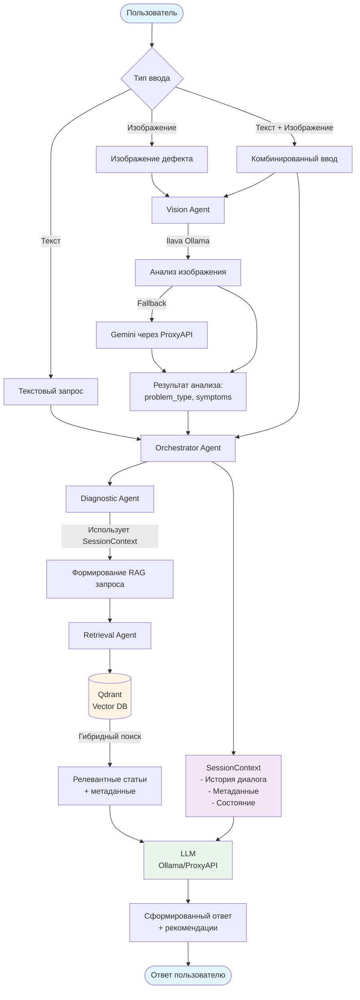
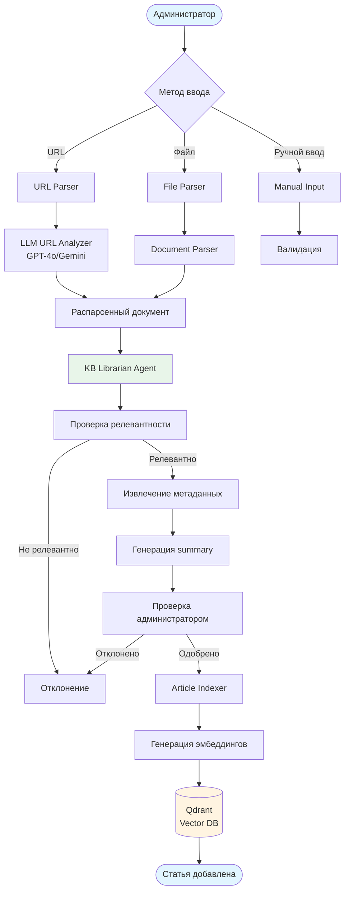

# Архитектура системы

## 🎯 Обзор

Система диагностики проблем 3D-печати построена на архитектуре агентов с использованием RAG (Retrieval Augmented Generation) и мультимодального анализа.

## 📊 Dataflow диаграмма

### Основной поток данных (диагностика)



### Поток данных для добавления статей в KB



## 🤖 Агенты системы

### 1. KB Librarian Agent (Агент-куратор KB)

**Назначение:** Цензурирование информации, извлеченной парсером, и подготовка статей для KB.

**Задачи:**
- ✅ Проверка релевантности и качества контента
- ✅ Фильтрация нерелевантной информации
- ✅ Извлечение и валидация метаданных
- ✅ Генерация summary и структурированных данных

**Компоненты:**

```
┌─────────────────────────────────────────┐
│  KB Librarian Agent                     │
│  ├── Content Validator                   │
│  │   - Проверка релевантности            │
│  │   - Проверка качества                 │
│  │   - Фильтрация мусора                 │
│  ├── Metadata Extractor                  │
│  │   - Извлечение структурированных      │
│  │     метаданных                         │
│  │   - Валидация метаданных              │
│  ├── Summary Generator                   │
│  │   - Генерация краткого изложения      │
│  │   - Извлечение проблем и решений      │
│  └── Relevance Filter                    │
│      - Фильтрация по порогу релевантности│
└─────────────────────────────────────────┘
```

**Реализация:** `backend/app/agents/kb_librarian.py`

### 2. Diagnostic Agent (Агент диагностики)

**Назначение:** Диагностика проблем пользователя на основе запроса и контекста.

**Задачи:**
- ✅ Анализ запроса пользователя
- ✅ Формирование RAG запроса с фильтрами
- ✅ Генерация рекомендаций на основе найденных статей
- ✅ Определение необходимости уточняющих вопросов

**Процесс работы:**

1. Получение запроса пользователя
2. Анализ контекста (модель принтера, материал, история диалога)
3. Формирование RAG запроса с фильтрами
4. Поиск релевантных статей в KB
5. Генерация ответа с рекомендациями
6. Определение необходимости уточнений

**Реализация:** `backend/app/main.py` (endpoint `/api/diagnose`)

### 3. Vision Agent (Агент анализа изображений)

**Назначение:** Анализ изображений дефектов печати.

**Задачи:**
- ✅ Определение типа проблемы по изображению
- ✅ Извлечение симптомов
- ✅ Генерация описания дефекта

**Реализация:** Планируется (ШАГ 8)

## 🔧 Сервисы

### 1. RAG Service

**Назначение:** Гибридный поиск в векторной БД.

**Возможности:**
- Семантический поиск по эмбеддингам
- Фильтрация по метаданным (модель принтера, материал, тип проблемы)
- Ранжирование результатов по релевантности

**Реализация:** `backend/app/services/rag_service.py`

### 2. Vector DB Service

**Назначение:** Работа с Qdrant (векторная БД).

**Возможности:**
- Индексация статей с эмбеддингами
- Индексация изображений с эмбеддингами
- Поиск по тексту и изображениям

**Реализация:** `backend/app/services/vector_db.py`

### 3. LLM Client

**Назначение:** Универсальный клиент для работы с LLM.

**Поддерживаемые провайдеры:**
- Ollama (локально)
- OpenAI через ProxyAPI
- Gemini через ProxyAPI

**Автоматический fallback:** При недоступности основного провайдера система автоматически переключается на доступный.

**Реализация:** `backend/app/services/llm_client.py`

### 4. Article Indexer

**Назначение:** Индексация статей в векторную БД.

**Процесс:**
1. Генерация эмбеддингов для текста статьи
2. Генерация эмбеддингов для изображений (если есть)
3. Сохранение в Qdrant с метаданными

**Реализация:** `backend/app/services/article_indexer.py`

## 📦 Структура данных

### Статья в KB

```json
{
  "article_id": "stringing_pla_ender3",
  "title": "Как устранить stringing при печати PLA",
  "content": "Полный текст статьи...",
  "url": "https://3dtoday.ru/...",
  "section": "Техничка",
  "date": "2024-01-15",
  "relevance_score": 0.95,
  "quality_score": 0.90,
  "problem_type": "stringing",
  "printer_models": ["Ender-3", "Ender-3 V2"],
  "materials": ["PLA"],
  "symptoms": ["ниточки между деталями", "сопли"],
  "solutions": [
    {
      "parameter": "retraction_length",
      "value": 6,
      "unit": "mm",
      "description": "Увеличьте retraction до 6 мм"
    }
  ],
  "abstract": "Краткое изложение статьи...",
  "embedding": [0.123, 0.456, ...]  // 768-мерный вектор
}
```

## 🔄 Потоки данных

### Диагностика проблемы

1. **Ввод пользователя** → Текст/Изображение/Комбинация
2. **Обработка** → Vision Agent (если есть изображение)
3. **Формирование запроса** → Diagnostic Agent
4. **Поиск в KB** → RAG Service → Qdrant
5. **Генерация ответа** → LLM с контекстом найденных статей
6. **Ответ пользователю** → Рекомендации + уточняющие вопросы

### Добавление статьи

1. **Ввод администратора** → URL/Файл/Ручной ввод
2. **Парсинг** → LLM URL Analyzer / Document Parser
3. **Анализ** → KB Librarian Agent
4. **Проверка релевантности** → Фильтрация по порогу
5. **Извлечение метаданных** → Структурирование данных
6. **Проверка администратором** → Одобрение/Отклонение
7. **Индексация** → Article Indexer → Qdrant

## 📚 Дополнительная информация

- Подробнее о работе агентов: см. исходный код в `backend/app/agents/`
- Подробнее о сервисах: см. исходный код в `backend/app/services/`
- Dataflow диаграммы: см. `DATAFLOW_DIAGRAM.md` (в archive/)
