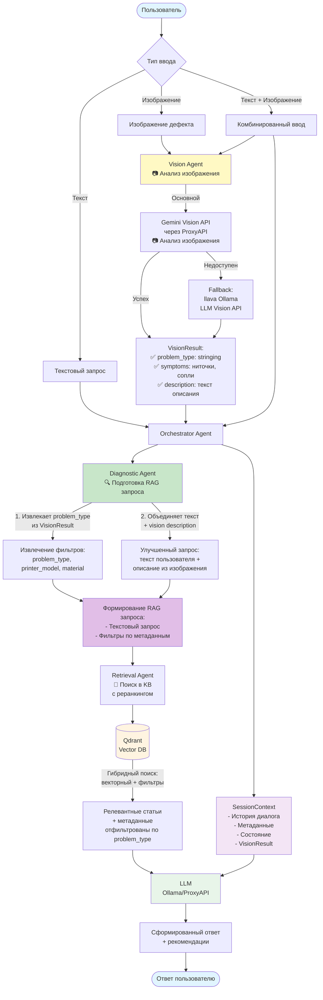
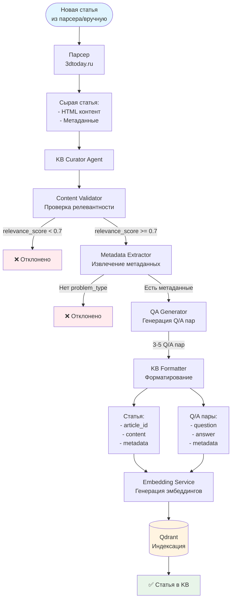

# Архитектура системы 3dtoday

## 🎯 Обзор

Система диагностики проблем 3D-печати построена на архитектуре агентов с использованием RAG (Retrieval Augmented Generation) и мультимодального анализа.

---

## 📊 Dataflow диаграммы

### Основной поток данных (диагностика)

**Ключевая идея:** VisionAgent и DiagnosticAgent работают ДО RAG, чтобы подготовить правильный запрос и фильтры для более точного поиска.



### Поток данных RAG поиска с реранкингом

**Ключевая особенность:** RAG использует **гибридный поиск** - комбинацию эмбеддингов (семантический поиск) и ключевых слов (фильтрация по метаданным), с последующим реранкингом через Cross-Encoder.

```mermaid
flowchart TD
    UserQuery([Запрос пользователя:<br/>текст + опционально фильтры]) --> QueryProcessing[Обработка запроса]
    
    QueryProcessing --> ContextExtraction[Извлечение контекста<br/>из SessionContext]
    
    ContextExtraction --> Filters[Фильтры-ключевые слова:<br/>- problem_type: stringing<br/>- printer_model: Ender-3<br/>- material: PLA]
    
    UserQuery --> EmbeddingGen[Генерация эмбеддинга<br/>запроса<br/>SentenceTransformer]
    
    EmbeddingGen --> QueryEmbedding[Вектор запроса<br/>768-мерный эмбеддинг]
    
    QueryEmbedding --> QdrantSearch[Qdrant query_points<br/>query: вектор запроса<br/>query_filter: фильтры]
    Filters --> QdrantFilter[Qdrant Filter<br/>MatchValue/MatchAny<br/>по метаданным]
    
    QdrantFilter --> QdrantSearch
    
    QdrantSearch --> HybridSearch[Гибридный поиск в Qdrant:<br/>1. Фильтрация ДО поиска (query_filter):<br/>   только статьи с нужными метаданными<br/>2. Векторный поиск по эмбеддингам:<br/>   cosine similarity среди отфильтрованных]
    
    HybridSearch --> TopK[Top-K результатов<br/>k=10-20<br/>отсортированы по cosine similarity]
    
    TopK --> BoostFilters{boost_filters?}
    
    BoostFilters -->|Да| BoostScore[Бустинг score:<br/>+0.1 за problem_type<br/>+0.1 за printer_model<br/>+0.1 за material]
    BoostFilters -->|Нет| Reranking
    
    BoostScore --> Reranking[Re-ranking<br/>Cross-Encoder модель<br/>✅ Реализовано]
    
    Reranking -->|Оценивает пары<br/>query + article| RerankedResults[Переранжированные результаты<br/>более точная оценка релевантности<br/>находит лучшие контексты<br/>даже с худшим cosine distance]
    
    RerankedResults --> RelevanceFilter[Фильтрация по<br/>relevance_score >= 0.3]
    
    RelevanceFilter --> Articles[Топ-K релевантных статей<br/>k=5<br/>с метаданными]
    
    Articles --> ContextFormation[Формирование контекста<br/>для LLM]
    
    ContextFormation --> LLMPrompt[Промпт для LLM:<br/>- Запрос<br/>- Контекст из статей<br/>- Инструкции]
    
    LLMPrompt --> LLM[LLM генерация<br/>Ollama/ProxyAPI]
    
    LLM --> Answer[Ответ с решениями<br/>+ параметрами]
    
    Answer --> UserResponse([Ответ пользователю])
    
    style UserQuery fill:#e1f5ff
    style UserResponse fill:#e1f5ff
    style QdrantSearch fill:#fff4e1
    style LLM fill:#e8f5e9
    style QueryEmbedding fill:#c8e6c9
    style QdrantFilter fill:#ffccbc
    style HybridSearch fill:#e1bee7
    style Reranking fill:#fff9c4
    style RerankedResults fill:#c5e1a5
```

### Поток данных для добавления статей в KB



---

## 🤖 Агенты системы

### 1. KB Librarian Agent (Агент-куратор KB)

**Назначение:** Цензурирование информации, извлеченной парсером, и подготовка статей для KB.

**Задачи:**
- ✅ Проверка релевантности и качества контента
- ✅ Фильтрация нерелевантной информации
- ✅ Извлечение и валидация метаданных
- ✅ Генерация summary и структурированных данных

**Реализация:** `backend/app/agents/kb_librarian.py`

### 2. Diagnostic Agent (Агент диагностики)

**Назначение:** Подготовка RAG запроса на основе запроса пользователя и результатов VisionAgent.

**Ключевая роль:** DiagnosticAgent работает **ДО** RAG поиска, чтобы:
- Использовать структурированные данные из VisionAgent (`problem_type`, `symptoms`)
- Сформировать правильные фильтры для RAG поиска
- Улучшить текстовый запрос, объединив текст пользователя + описание из изображения

**Реализация:** `backend/app/main.py` (endpoint `/api/diagnose`)

### 3. Vision Agent (Агент анализа изображений)

**Назначение:** Анализ изображений дефектов печати и извлечение структурированных данных.

**Ключевая роль:** VisionAgent работает **ДО** RAG поиска, чтобы преобразовать визуальную информацию в структурированные данные, которые используются для фильтрации RAG запроса.

**Роль Gemini:**
- 📷 **Gemini Vision API** используется для анализа изображений пользователя (когда пользователь загружает фото дефекта)
- 🔄 Gemini анализирует изображение и возвращает структурированные данные (`problem_type`, `symptoms`, `description`)
- ✅ Эти данные используются DiagnosticAgent для формирования фильтров RAG запроса
- ⚠️ Если Gemini недоступен, используется fallback на llava/Ollama

**Реализация:** `backend/app/services/vision_analyzer.py`

### 4. Retrieval Agent (Агент поиска) ⭐

**Назначение:** Продвинутый поиск в KB с реранкингом и поддержкой контекста изображений.

**Ключевые возможности:**
- ✅ Гибридный поиск (векторный + фильтры по метаданным)
- ✅ **Re-ranking через Cross-Encoder** для улучшения качества результатов
- ✅ Поддержка контекста изображений в запросах
- ✅ Умное формирование запросов с учетом визуального контекста

**Реализация:** `backend/app/agents/retrieval_agent.py`

---

## 🔧 Сервисы

### 1. RAG Service

**Назначение:** Гибридный поиск в векторной БД с поддержкой реранкинга.

**Как работает гибридный поиск:**

1. **Фильтрация ДО поиска (query_filter):**
   - Фильтры (`problem_type`, `printer_model`, `material`) → точное совпадение через `MatchValue`/`MatchAny`
   - Qdrant фильтрует **ДО** векторного поиска через `query_filter`
   - Оставляет только статьи с нужными метаданными из всей коллекции

2. **Векторный поиск по эмбеддингам:**
   - Текстовый запрос → `generate_embedding(query)` → вектор (768 чисел)
   - Векторный поиск в Qdrant по cosine similarity **среди уже отфильтрованных статей**

3. **Re-ranking через Cross-Encoder:**
   - Получаем топ-10-20 кандидатов по cosine similarity
   - Cross-Encoder переоценивает каждую пару (запрос + статья)
   - Более точная оценка релевантности, учитывающая семантику запроса и контекста
   - Находит лучшие контексты, даже если у них хуже cosine distance

**Реализация:** `backend/app/services/rag_service.py`

### 2. Vector DB Service

**Назначение:** Работа с Qdrant (векторная БД).

**Возможности:**
- Индексация статей с эмбеддингами
- Индексация изображений с эмбеддингами
- Поиск по тексту и изображениям

**Реализация:** `backend/app/services/vector_db.py`

### 3. LLM Client

**Назначение:** Универсальный клиент для работы с LLM.

**Поддерживаемые провайдеры:**
- Ollama (локально)
- OpenAI через ProxyAPI
- Gemini через ProxyAPI

**Реализация:** `backend/app/services/llm_client.py`

### 4. Article Indexer

**Назначение:** Индексация статей в векторную БД.

**Реализация:** `backend/app/services/article_indexer.py`

---

## 📦 Структура данных

### Статья в KB

```json
{
  "article_id": "stringing_pla_ender3",
  "title": "Как устранить stringing при печати PLA",
  "content": "Полный текст статьи...",
  "url": "https://3dtoday.ru/...",
  "problem_type": "stringing",
  "printer_models": ["Ender-3", "Ender-3 V2"],
  "materials": ["PLA"],
  "symptoms": ["ниточки между деталями", "сопли"],
  "solutions": [
    {
      "parameter": "retraction_length",
      "value": 6,
      "unit": "mm",
      "description": "Увеличьте retraction до 6 мм"
    }
  ]
}
```

---

## 📚 Дополнительная информация

- Подробнее о работе агентов: см. исходный код в `backend/app/agents/`
- Подробнее о сервисах: см. исходный код в `backend/app/services/`
- Старые версии документации: см. `archive/ARCHITECTURE.md` и `archive/DATAFLOW_DIAGRAM.md`
